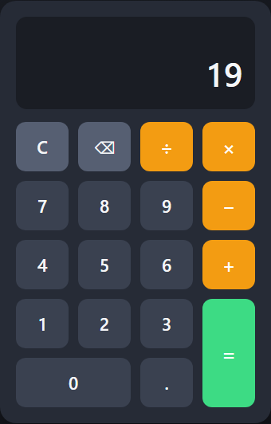

# Calculator

A simple, responsive calculator built with pure HTML, CSS, and JavaScript. A Level 2 task for the Oasis Infobyte Web Development & Design internship.

## Features

- Basic arithmetic: addition, subtraction, multiplication, and division
- Chained operations (e.g., `12 + 7 - 3 = 16`)
- Display shows both the live expression and the current result
- Divide-by-zero error handling with a friendly message
- Clear (`C`) and backspace buttons
- Prevents entering multiple decimal points
- Max input length of 12 digits with overflow protection
- Floating-point precision cleanup (e.g., `0.1 + 0.2 = 0.3`)
- Dark theme with hover/active button states and press animations
- Fully responsive layout that works on desktop and mobile

## Technologies

- **HTML5** – page structure and button layout
- **CSS3** – dark theme, grid-based button keypad, responsive design
- **JavaScript (Vanilla)** – calculator logic, expression handling, and DOM updates

## How to Run

### Option 1: Open directly (no setup needed)

1. Clone or download this repository.
2. Double-click `index.html` to open it in any modern browser.

### Option 2: Local server

1. Clone the repository and `cd` into the project folder.
2. Start a static server, for example:

   ```bash
   python -m http.server 8000
   ```

3. Open `http://localhost:8000` in your browser.

No build tools, dependencies, or installation required.

## Screenshots

