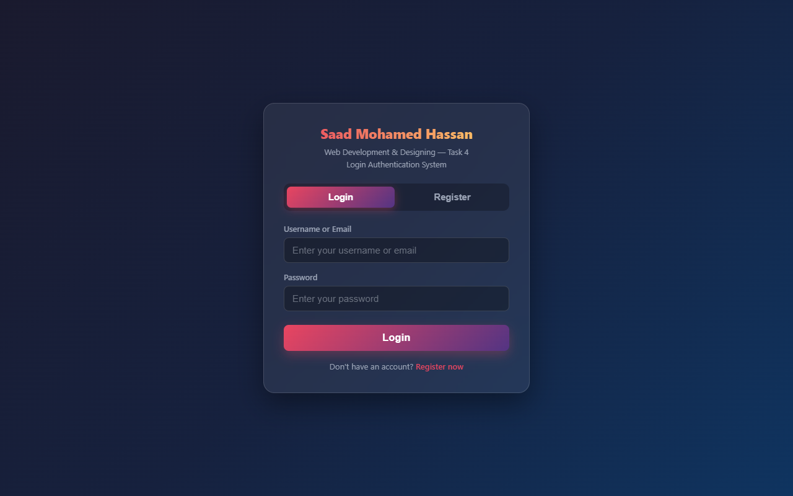
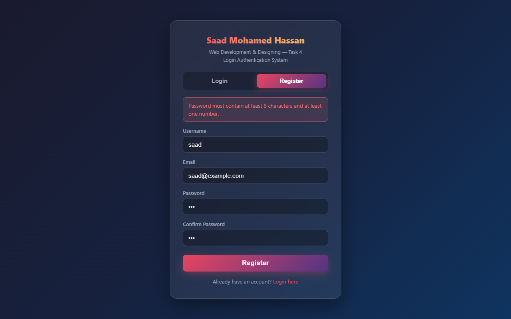
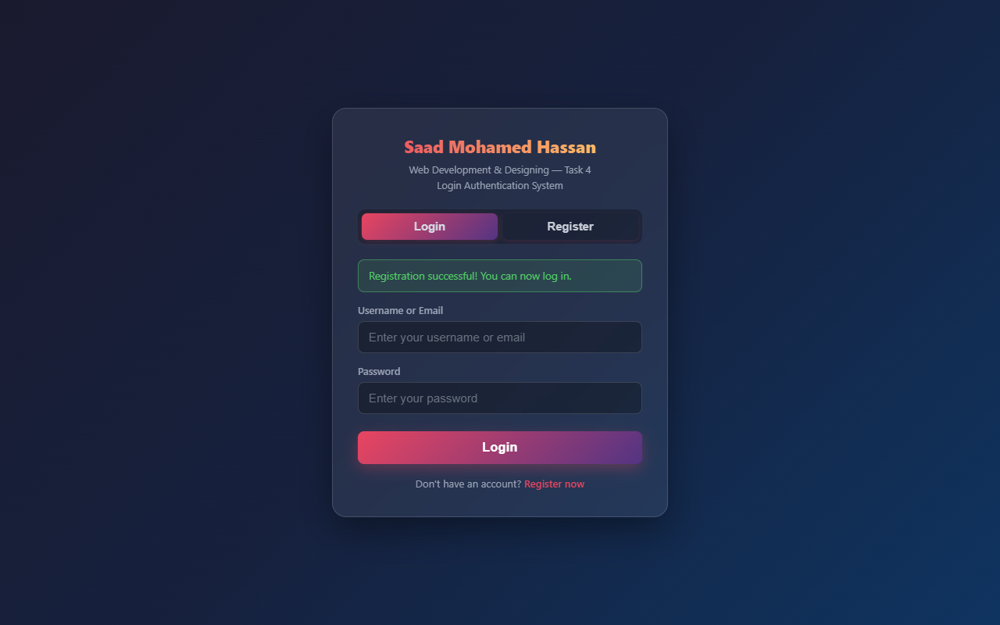
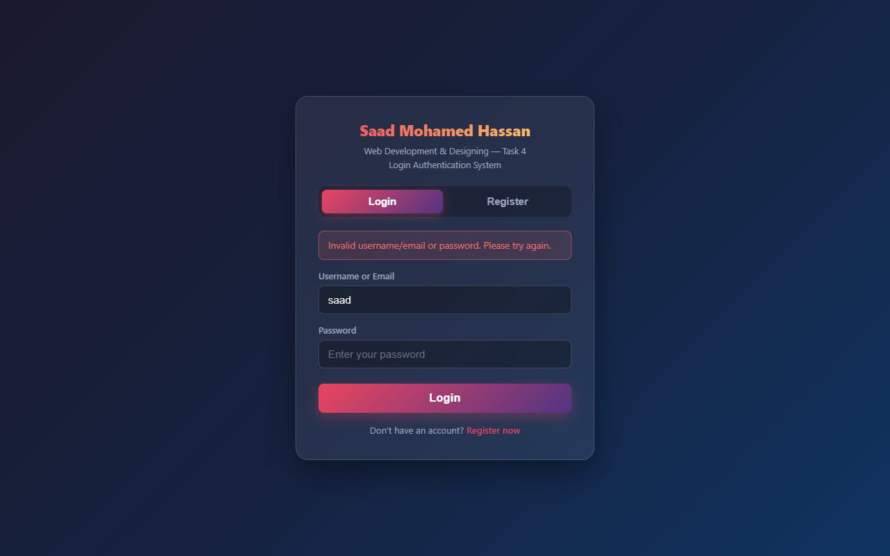
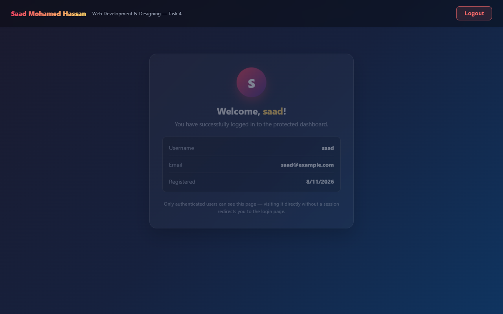

# Saad Mohamed Hassan — Login Authentication System

**Task 4** · Web Development & Designing Internship

A simple client-side (Approach A) login authentication system built with
**HTML / CSS / JavaScript + localStorage**. Includes user registration, login
validation, session handling, a protected dashboard page, and logout.

## Features

- **Registration page** — username, email, password + confirm password with a "Register" button
- **Password validation** — minimum 8 characters and at least one number
- **Duplicate check** — errors if the username/email is already registered
- **Login page** — username/email + password with a "Login" button
- **Generic error handling** — "Invalid username/email or password" (never reveals which field is wrong)
- **Protected dashboard** — redirects to login if opened directly without a session
- **Logout button** — clears the session and redirects to login
- **Hashed passwords** — SHA-256 (Web Crypto API) with a per-user random salt; no plain-text storage
- **Basic form validation** — empty submissions blocked on both pages
- **Splash intro** — shows "Saad Mohamed Hassan — Web Development & Designing Task 4 / Login Authentication System" for 2 seconds on load

## Files

| File | Purpose |
|---|---|
| `index.html` | Splash screen + login/register page |
| `dashboard.html` | Protected dashboard page |
| `script.js` | Auth logic (hashing, storage, session, guards) |
| `style.css` | Styling |
| `screenshots/` | Screen captures of the flow |

## How to run

Since this is a pure front-end app, just open `index.html` in a browser:

```
start index.html
```

## How it works

1. On registration, a random salt is generated and the password is hashed with
   **SHA-256** (`salt::password::salt`) via the browser's Web Crypto API.
   Only the username, email, salt, and hash are stored in `localStorage` under `auth_users`.
2. On login, the entered password is hashed with the stored salt and compared
   against the stored hash.
3. On success, the user id is stored under `auth_session`.
4. `dashboard.html` checks for a session on load; missing/invalid sessions are
   redirected to `index.html`.
5. Logout clears `auth_session` and returns to the login page.

> Note: client-side storage is not secure against determined attackers —
> this is an educational demo for the internship task.

## Screenshots

| | |
|---|---|
| Splash intro (first 2 seconds) | Login page |
|  |  |
| Registration validation | Successful registration |
|  |  |
| Login error (generic message) | Protected dashboard |
|  |  |

## Test credentials

Register a new account, then log in with the same username/email + password.
To test the protected page, open `dashboard.html` directly in a new tab while
logged out — it should redirect you to the login page.
