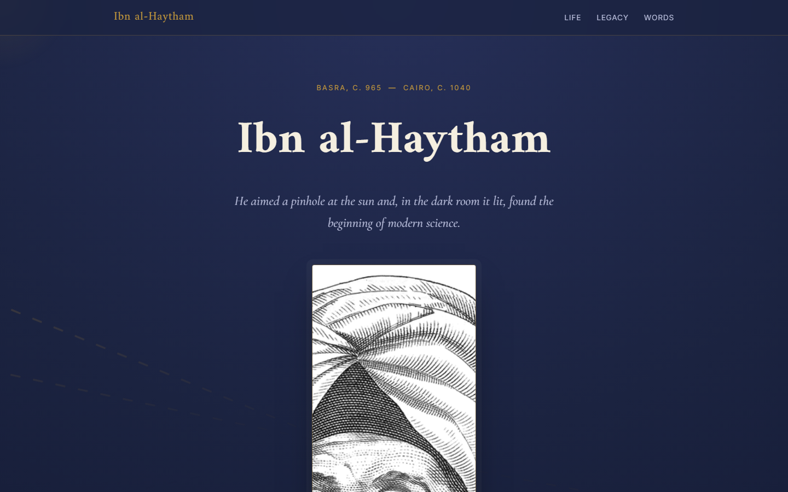
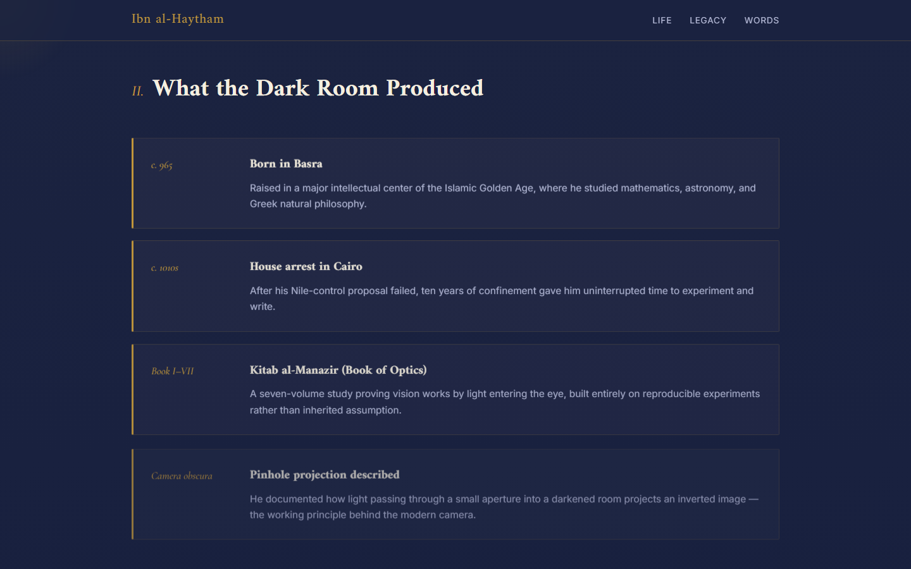

# Ibn al-Haytham Tribute Page

## Project
A tribute page dedicated to **Ibn al-Haytham** (c. 965 – c. 1040), one of the most important scholars of the Islamic Golden Age, often called the "father of modern optics." He was the first to correctly explain how vision works (the eye receives light, it does not emit it), and he pioneered the experimental scientific method centuries before Galileo and Newton.

The visual concept of the page is built around his most famous experiment: the **camera obscura** (a darkened room with a pinhole letting light through). The hero section features an animated SVG converging on a single point of light, echoing that experiment, and the color palette draws from old manuscripts — deep indigo night, aged parchment, and illuminated gold.

## Features
- Page title with the subject's name and a one-line tagline
- A prominent portrait image sourced from **Wikimedia Commons** (public domain)
- A tribute/biography section made up of 4 original paragraphs (paraphrased from Wikipedia)
- A timeline section with 7 milestone cards, ordered by year
- A quote block, styled distinctly with a copper background and italic serif type
- Multiple background colors across sections (deep indigo `#1B2340`, parchment `#EDE3D0`, copper `#A85C32`)
- Two typeface families: **Amiri** (serif, for headings) and **Inter** (sans-serif, for body text), plus **Cormorant Garamond** (italic) for the quote
- Fully responsive layout down to small mobile screens
- Optional light JavaScript enhancements: scroll-reveal animation + a subtle cursor glow

## Technologies
- **HTML5** — semantic structure (`header`, `main`, `section`, `figure`, `blockquote`)
- **CSS3** — custom properties (CSS variables), Grid, Flexbox, `clamp()` for responsive typography, CSS animations for the light rays
- **JavaScript (Vanilla, optional)** — `IntersectionObserver` for scroll-reveal, and a simple cursor-follow effect
- **Google Fonts** — Amiri / Inter / Cormorant Garamond

## How to Run
This is a plain HTML/CSS/JS project — no build step or dependencies required.

1. Download or unzip the folder
2. Open `index.html` directly in any browser (Chrome / Edge / Firefox)

Or, to run it with a simple local server (optional):

```bash
# Using Python (available on most machines)
python3 -m http.server 5500
# then open http://localhost:5500
```

```bash
# Or using VS Code
# Install the "Live Server" extension and click "Go Live"
```

## Structure
```
tribute-ibn-al-haytham/
├── index.html      # page structure
├── styles.css       # all styling, colors, and typography
├── script.js        # optional JS enhancements (scroll reveal)
└── README.md         # this file
```

## Screenshots
To add screenshots to the GitHub repo:

1. Run the page locally as described in "How to Run"
2. Capture at least the hero section and the timeline section (desktop + mobile view via DevTools)
3. Put the images in a new `screenshots/` folder inside the project
4. Add them here like this:

```markdown



```

## Sources
- Text content: [Wikipedia – Ibn al-Haytham](https://en.wikipedia.org/wiki/Ibn_al-Haytham) (fully paraphrased) and [Britannica – Ibn al-Haytham](https://www.britannica.com/biography/Ibn-al-Haytham)
- Image: [Wikimedia Commons – File:Ibn al-Haytham.png](https://commons.wikimedia.org/wiki/File:Ibn_al-Haytham.png) (portrait from the 1982 Iraqi ten-dinar banknote)